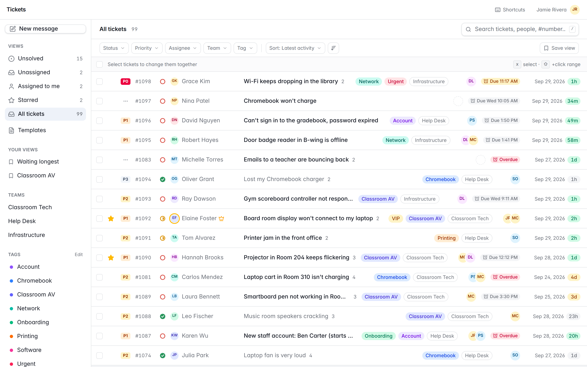
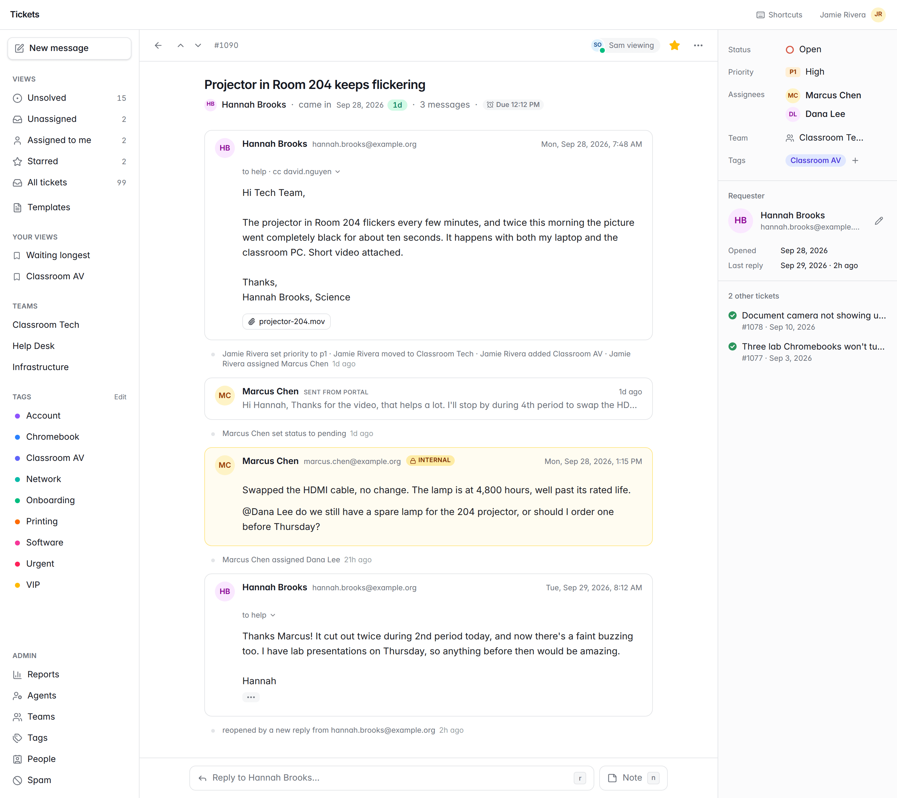
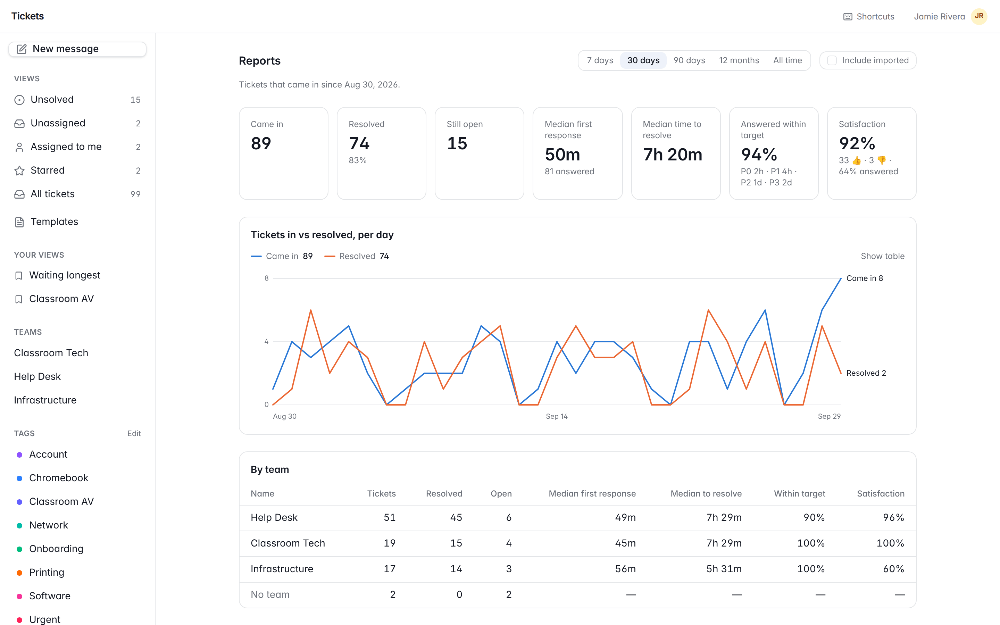
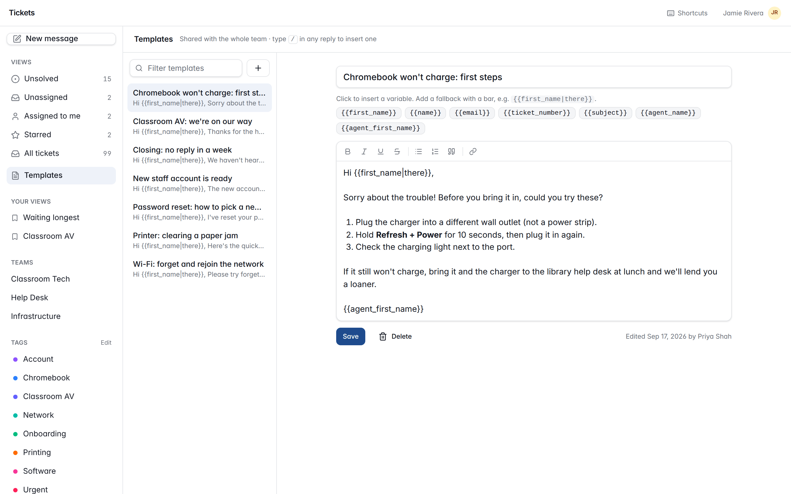

# Groupdesk

A shared inbox for mail sent to a Google Group. Gmail pushes changes to
Pub/Sub, this app turns them into tickets, and agents reply from the portal
with threading that lands correctly in the requester's inbox.



It was built for a school's tech team, so a few defaults lean that way (reply
targets count school hours; an optional directory integration tags faculty as
VIP), but nothing depends on it being a school.

- Tickets from group mail, with forwards and group-rewritten senders resolved
  to the real requester
- Rich replies sent as the group, threaded by headers and by a `[TICKET: #1234]`
  subject tag
- Assignment (multiple agents), teams, tags, priorities P0–P3, stars, notes with
  @mentions, merge, spam blocking, saved views
- Reply-target (SLA) tracking, reports, weekly digest email, satisfaction survey
- Templates with variables, keyboard shortcuts, live refresh, collision detection

## Stack

| Piece | Choice |
| --- | --- |
| Framework | Next.js 16 App Router, React 19, TypeScript |
| Database | Neon Postgres via Drizzle (`drizzle-orm/neon-serverless`, pooled URL) |
| Styling | Tailwind v4, shadcn-style components in `src/components/ui` |
| Attachments | Vercel Blob |
| Login | Cloudflare Access, JWT verified with `jose` in `src/proxy.ts` |
| Mail | `@googleapis/gmail`, `postal-mime` to parse, `mimetext` to compose |

## Using it



### Ticket statuses

| Status | Meaning | How it gets there |
| --- | --- | --- |
| **Open** | Waiting on us | New mail, or the requester writes back on any other status |
| **Pending** | Waiting on the requester | Replying to an open ticket |
| **Solved** | Done | By hand, or auto-solved after `AUTO_SOLVE_DAYS` pending with no reply |
| **Closed** | Not a request (notifications, spam, merged tickets) | By hand, by merging or marking as spam, or new mail from a blocked sender. Never on a timer; left out of reports |

A reply from the requester reopens the ticket whatever its status, as long as
it's the newest email on it. Older mail that arrives late (from a catch-up or
backfill) never changes the status.

### Agents and admins

There are two roles. **Agents** work tickets, write templates and can mark
senders as spam. **Admins** also manage agents, teams and tags, unblock
senders, refresh directory photos, and see reports. Only the admin whose
address is `GMAIL_MAILBOX` can connect or reconnect Gmail.

Add people at **Admin → Agents**. They also have to be allowed through
Cloudflare Access. Anyone who gets through Access without being an active
agent is refused. Deactivating an agent keeps their name on past tickets.

### Keyboard shortcuts

Press `?` anywhere for the full list.

| Where | Keys |
| --- | --- |
| Anywhere | `/` search · `⇧C` new message · `g` then `u` / `m` / `n` / `s` / `a` for Unsolved, Mine, Unassigned, Starred, All |
| Ticket list | `j` / `k` move · `Enter` open · `s` star · `i` assign to me · `x` select (`⇧X` range), then `a` `p` `c` `t` `m` to assign, prioritise, change status, tag or move team |
| Ticket | `r` reply · `n` note · `⌘Enter` send · `e` solve · `a` `p` `c` `t` `m` as above · `j` / `k` next and previous ticket · `u` or `Esc` back |

## How mail becomes a ticket

```
Gmail (label on group mail)
  └─ users.watch ──► Pub/Sub topic
                        └─ push (OIDC) ──► POST /api/gmail/push
                                              ├─ verify the OIDC token
                                              ├─ SELECT ... FOR UPDATE on gmail_sync
                                              ├─ history.list from OUR stored cursor
                                              ├─ messages.get(format: raw) → postal-mime
                                              └─ ingest → tickets / messages / events
```

Two things make this safe to retry:

- **Idempotence.** `messages.gmail_message_id` is unique, so a redelivered push
  is a no-op. The handler returns 500 on failure specifically so Pub/Sub retries.
- **Our cursor, not theirs.** The `historyId` in the notification is treated as
  a signal only. We always resume from `gmail_sync.last_history_id`, so a
  notification that arrives out of order or gets dropped costs nothing.

If `history.list` returns 404 the stored cursor has aged out (Gmail keeps about
a week). The sync falls back to `messages.list` with `newer_than:7d` and
re-anchors on the mailbox's current `historyId`. Dedupe makes that cheap.

`/api/cron/gmail-reconcile` runs the identical sync on a timer. Pushes give
speed; the cron gives the guarantee that a dropped push costs minutes rather
than a lost ticket.

## Setup

### Requirements

- Node.js 20.9 or newer, and pnpm 11 (`corepack enable` gets you the version
  pinned in `package.json`)
- A Google Workspace domain where you can create a Google Group and an
  Internal OAuth app
- A Google Cloud project (Gmail API, Pub/Sub)
- A Neon Postgres database
- Vercel for hosting, cron and attachment storage (Blob)
- Cloudflare Access in front of the app, for sign-in

You need a Google Workspace domain with a Google Group for requesters to write
to, and one mailbox in that domain that receives the group's mail. Every
variable mentioned below is described in `.env.example`.

### 1. Google Cloud

1. Create a project and enable the **Gmail API**, **Cloud Pub/Sub API** and
   **People API** (the last one is for directory profile photos).
2. OAuth consent screen: **Internal**. An External app left in Testing has its
   refresh tokens expire after 7 days. The app asks for `gmail.readonly`,
   `gmail.send` and `directory.readonly`.
3. Create a **Web application** OAuth client with these redirect URIs, and put
   its ID and secret in `GOOGLE_CLIENT_ID` / `GOOGLE_CLIENT_SECRET`:
   - `https://<your domain>/api/admin/gmail/callback`
   - `http://localhost:3000/api/admin/gmail/callback`
4. Create a Pub/Sub topic (`GMAIL_PUBSUB_TOPIC`, e.g.
   `projects/<project>/topics/gmail-tickets`) and grant
   `gmail-api-push@system.gserviceaccount.com` the **Pub/Sub Publisher** role
   on it.
5. Create a service account for push authentication (`GMAIL_PUSH_SA_EMAIL`).
   It needs no roles of its own.
6. Create a **push** subscription on the topic: endpoint
   `https://<your domain>/api/gmail/push`, authentication on, using that
   service account, audience equal to `GMAIL_PUSH_AUDIENCE` (defaults to the
   endpoint URL). A dead-letter topic is a good idea.

### 2. Gmail

In the mailbox you'll connect (`GMAIL_MAILBOX`), create a filter:

- Matches: `list:<group>.<domain>` (e.g. `list:help.example.org`)
- Apply label: the value of `GMAIL_LABEL_NAME`
- Optionally skip the inbox, so a personal inbox stays clean

The watch is scoped to this label (`labelFilterBehavior: 'include'`), so nothing
else in the mailbox produces a push. The app resolves the label name to an id
and caches it on `gmail_sync`.

To send replies as the group, add `GROUP_EMAIL` as a verified alias in that
mailbox: Gmail Settings → Accounts → "Send mail as". `/admin/gmail` shows
whether it is. Until then Gmail sends from the mailbox itself.

### 3. Run it locally

```bash
pnpm install
cp .env.example .env.local
```

Fill in the Google and Gmail values above, plus at minimum:

- `DATABASE_URL`: a Neon **pooled** connection string (host contains `-pooler`)
- `TOKEN_ENC_KEY` and `CRON_SECRET`: generate them with the commands in `.env.example`
- `DEV_BYPASS_EMAIL`: your address; stands in for Cloudflare Access locally
- `SEED_ADMIN_EMAIL`: same address, for the seed script

```bash
pnpm db:migrate      # creates the schema and the ticket-number sequence
pnpm db:seed         # adds starter teams and tags; creates the admin if
                     # SEED_ADMIN_EMAIL is set
pnpm db:verify       # prints the tables, enums, constraints and row counts
pnpm dev
```

`db:seed` is safe to re-run: every insert is `on conflict do nothing`.

Then visit `/admin/gmail` and press **Connect Gmail**, signed in as
`GMAIL_MAILBOX`. From there:

1. `pnpm gmail:sync` runs the ingest pipeline against real group mail without
   any watch or push involved. Run it repeatedly and read the tickets it
   creates. `pnpm test:ingest` covers the header parsing offline.
2. `pnpm gmail:watch` (or the button on `/admin/gmail`) registers the watch.
   Pushes need a public URL, so this part is easiest to check once deployed.
3. `pnpm gmail:backfill` (or the Backfill card) imports past group mail. Those
   tickets are marked `imported` and left out of reports by default.

### 4. Deploy (Vercel)

1. Create the Vercel project and a Neon database, then set every variable from
   `.env.example` in Vercel (Production and Preview). `NEXT_PUBLIC_*` values
   are baked in at build time, so redeploy after changing them.
2. Set `APP_URL` to the production URL, and keep `GMAIL_PUSH_AUDIENCE`
   identical to the push subscription's audience.
3. Add the domain, then create the Cloudflare Access application:
   - Allow policy listing agent emails, Google or one-time PIN
   - **Bypass** policies for `/api/gmail/push`, `/api/cron/*` and `/csat/*`.
     Access would otherwise block Google's push requests, which carry no Access
     cookie, and requesters answering the survey
   - Copy the team domain into `CF_ACCESS_TEAM_DOMAIN` and the Application
     Audience tag into `CF_ACCESS_AUD`
4. `vercel-build` runs `db:migrate` before `next build`, so schema changes ship
   with the deploy.

## Replies, photos and search

- **Sender.** Replies go out as `Agent Name <GROUP_EMAIL>` with the subject
  `[TICKET: #1234] Original subject`, signed with `NEXT_PUBLIC_TEAM_NAME`.
  `NEXT_PUBLIC_TICKET_TAG` sets the word in the tag.
- **Threading.** Incoming mail whose subject carries the tag joins that ticket
  even without In-Reply-To/References.
- **Profile photos** come from the Google Workspace directory (People API,
  `directory.readonly`), cached in `people` for a week; anyone outside the
  directory gets initials. Optionally, a people directory set by
  `ROSTER_API_URL` / `ROSTER_API_KEY` supplies photos and names first, and
  tickets from people it lists as faculty are tagged VIP. It must answer
  `GET /api/people?email=` as `src/lib/roster.ts` describes.
- **Templates** live at `/templates`, shared by the whole team. Type `/` in any
  reply to insert one; `{{first_name}}`, `{{ticket_number}}`, `{{agent_name}}`
  and friends are filled in, with `{{first_name|there}}` as a fallback form.
- **Reports** (`/admin/reports`, admins) leave out tickets marked `imported`
  (created by the backfill) unless asked to include them.
- **Reply targets (SLA)** are in school hours, Mon–Fri 8am–4pm in
  `NEXT_PUBLIC_TIME_ZONE` (`NEXT_PUBLIC_SCHOOL_HOURS="08:00-16:00"` to change):
  P0 2h, P1 4h, P2 or none 1 school day, P3 2 school days, counted from the
  requester's first unanswered email on an open ticket. Holidays aren't modelled.
- **Notifications** email an agent when they're assigned, when a requester
  replies on their ticket, or when they're @mentioned in a note. Each agent
  can switch them off from the avatar menu. Subjects carry `[<app name> notice]`;
  replies to them are ignored.
- **Satisfaction survey.** Solving a ticket emails the requester a 👍/👎 link
  (`CSAT_DISABLED=1` turns it off); it can also be sent from the ticket's ⋯ menu.
- **Merge** (ticket ⋯ menu) moves one ticket's emails, notes, tags and
  assignees into another; the old number redirects. **Mark as spam** closes it
  and blocks the sender (new mail from them arrives closed); unblock at
  `/admin/spam`.
- **Saved views**: filters and sort live in the URL; "Save view" stores the
  current one in your sidebar.
- **Search** is fuzzy (`pg_trgm`, enabled by migration 0001): typo-tolerant on
  subject and requester, plus exact text in message bodies and `#1234`.





## Crons and catch-up

`vercel.json` schedules `/api/cron/gmail-watch` (watch renewal) and
`/api/cron/gmail-reconcile` (catch-up sync) once a day each, which the Hobby
plan allows. Between those, the catch-up runs two other ways:

- **In the app.** The portal's 5-second poll runs the same sync whenever
  nothing has synced for 5 minutes, so dropped pushes are picked up as long
  as anyone has the portal open.
- **GitHub Actions**, every 10 minutes (`.github/workflows/gmail-reconcile.yml`).
  Set the repository variable `APP_URL` and the secret `CRON_SECRET` (same
  value as in Vercel) to turn it on; without them the job doesn't run.

Two more scheduled jobs:

- `/api/cron/daily` auto-solves tickets left **pending** (waiting on the
  requester) with no reply for `AUTO_SOLVE_DAYS` (default 7). A reply from
  the requester moves a pending ticket back to open, so only true silence
  counts. Closed is for non-requests (notifications, spam) and is never set
  automatically; reports leave closed tickets out.
- `/api/cron/digest` and `/api/cron/digest-winter` email every active agent
  their weekly digest at 4pm Friday in `NEXT_PUBLIC_TIME_ZONE`. Vercel cron is
  UTC with no DST, so both fire and only the one landing at 4pm local sends.
  The schedules in `vercel.json` are set for US Pacific; move them for another
  zone. Replies to the digest are ignored by ingest. Admins can send
  themselves a preview from `/admin/reports`.

The cron routes need a Cloudflare Access Bypass policy for `/api/cron/*`.

When a watch renewal, catch-up sync or digest fails, the app sends an alert to
`SLACK_WEBHOOK_URL` and/or `ALERT_EMAIL_TO` if either is set. Otherwise the
failure only shows up in the server log.

## Security notes

- **Email HTML is untrusted.** Message bodies render inside an iframe with an
  empty `sandbox` attribute: no scripts, no same-origin, no forms. See
  `src/components/message-body.tsx`.
- **Refresh tokens are encrypted at rest** with AES-256-GCM under
  `TOKEN_ENC_KEY` (`src/lib/crypto.ts`), not stored in plaintext.
- **Two independent gates.** Cloudflare Access decides who reaches the app;
  the `agents` table decides who the app will act for. Deactivating an agent
  here does not remove them from Access, so update both.
- **One mailbox.** Only `GMAIL_MAILBOX` can be connected, and only that agent
  (as an admin) can manage the connection.

To report a vulnerability, please use GitHub's private vulnerability reporting
on this repository rather than a public issue.

## Data model

All tables are defined in `src/db/schema.ts`. The migrations in `drizzle/`
are generated from it with `pnpm db:generate`.

| Table | Holds |
| --- | --- |
| `tickets` | Number (from a sequence), subject, requester, status, priority, team, Gmail thread, and whether it came from the backfill |
| `messages` | Every email in and out, plus internal notes, with Gmail and RFC 822 ids for threading; `gmail_message_id` is unique |
| `attachments` | Files in Vercel Blob, with Content-IDs so inline images render in place |
| `events` | The activity log on each ticket: status, assignment, tags, merges, survey results |
| `agents`, `teams`, `agent_teams` | Who can sign in, their role, and team membership |
| `tags`, `ticket_tags`, `ticket_assignees`, `ticket_stars` | Tags, multiple assignees, and per-agent stars |
| `templates`, `saved_views` | Shared reply templates and per-agent saved filters |
| `csat_surveys` | One row per survey email; its token is the requester's only credential |
| `people` | Cached names and photos from the directory, refreshed weekly |
| `ticket_presence` | Who has a ticket open or is typing (unlogged, disposable) |
| `blocked_senders` | Senders marked as spam |
| `gmail_sync` | The connected mailbox, encrypted refresh token, watch expiry and history cursor |

## Layout

```
src/
  proxy.ts                  Access JWT gate (Next 16's middleware convention)
  app/
    (portal)/               tickets list, ticket page, admin pages
    api/gmail/push          Pub/Sub push handler
    api/cron/*              watch renewal, reconcile, auto-solve, digest
    api/admin/gmail/*       OAuth connect and callback
    api/tickets/updates     poll target for live refresh
    csat/[token]            requester-facing satisfaction survey
  db/                       schema + lazy Neon client
  lib/
    gmail/{client,sync,ingest,send,backfill}.ts
    actions/{tickets,admin,templates,views}.ts
    auth.ts access-jwt.ts crypto.ts queries.ts alerts.ts env.ts
  components/               ui/, thread, composer, sidebar, admin forms
scripts/                    migrate, seed, gmail:watch, gmail:sync, test:ingest
```

## Commands

```bash
pnpm dev            # local dev
pnpm test           # typecheck + lint + offline ingest checks
pnpm db:generate    # new migration after editing src/db/schema.ts
pnpm db:migrate
pnpm db:verify      # read-only: what actually exists in the database
pnpm gmail:sync     # run the ingest pipeline by hand
pnpm gmail:watch    # start or renew the Gmail watch
pnpm gmail:backfill # import past group mail
```

## Troubleshooting

Start at `/admin/gmail`. It shows whether the mailbox is connected, when the
watch expires, the last push and sync, the last error, and which address
replies go out from.

- **No new tickets.** Check that the Gmail filter actually applies the label
  (the name must match `GMAIL_LABEL_NAME` exactly), that the watch hasn't
  expired, and that "Last push received" moves when mail arrives. If it
  doesn't and the Pub/Sub subscription shows deliveries failing with 401,
  the subscription's audience doesn't match `GMAIL_PUSH_AUDIENCE`, or its
  service account isn't `GMAIL_PUSH_SA_EMAIL`.
- **Gmail disconnects after a week.** The OAuth consent screen is External in
  Testing mode, whose refresh tokens expire after 7 days. Make it Internal and
  reconnect.
- **Replies come from the mailbox, not the group.** `GROUP_EMAIL` isn't a
  verified "Send mail as" alias in that mailbox yet. `/admin/gmail` says which.
- **"Not authorized" after signing in.** The person passed Cloudflare Access
  but isn't an active agent. Add them at Admin → Agents.
- **Pushes, crons or survey links are blocked.** They need the Cloudflare
  Access Bypass policies for `/api/gmail/push`, `/api/cron/*` and `/csat/*`.
- **A changed `NEXT_PUBLIC_*` value doesn't show up.** These are baked in at
  build time, so redeploy.
- **Missed mail.** `pnpm gmail:sync` (or "Sync now" on `/admin/gmail`) runs the
  catch-up by hand. Syncing is idempotent, so it's always safe to run.

## Contributing

Issues and pull requests are welcome. Run `pnpm test` (typecheck, lint and the
offline ingest checks) before sending a change. For schema changes, edit
`src/db/schema.ts` and commit the migration `pnpm db:generate` produces.

## License

[MIT](LICENSE)
